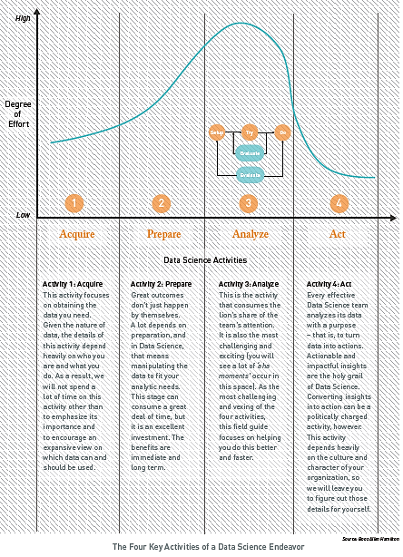
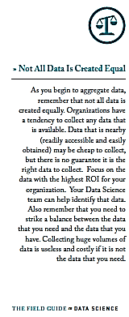
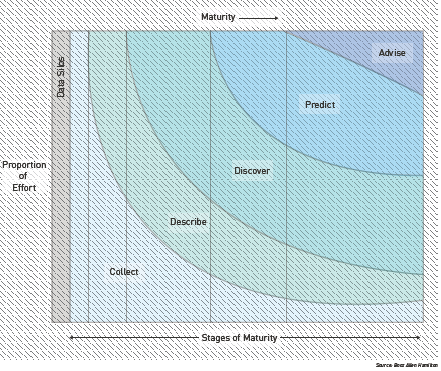
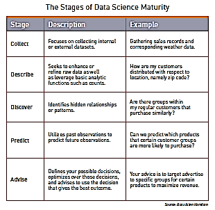
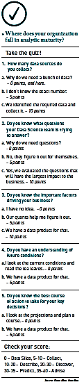

**How does Data Science Actually Work?**

\_\_\_\_\_\_\_\_\_\_\_\_\_\_\_\_\_\_\_\_\_\_\_\_\_\_\_\_\_\_\_\_\_\_\_\_\_\_\_\_\_\_\_\_\_\_\_\_\_\_\_\_\_\_\_\_\_\_\_\_\_\_\_\_\_\_\_\_\_\_\_\_\_\_\_\_\_\_\_\_\_\_\_\_\_

It’s not rocket science… it’s something better - Data Science

\_\_\_\_\_\_\_\_\_\_\_\_\_\_\_\_\_\_\_\_\_\_\_\_\_\_\_\_\_\_\_\_\_\_\_\_\_\_\_\_\_\_\_\_\_\_\_\_\_\_\_\_\_\_\_\_\_\_\_\_\_\_\_\_\_\_\_\_\_\_\_\_\_\_\_\_\_\_\_\_\_\_\_\_\_

Let’s not kid ourselves - Data Science is a complex field. It is difficult, intellectually taxing work, which requires the sophisticated integration of talent, tools and techniques. But as a field guide, we need to cut through the complexity and provide a clear, yet effective way to understand this new world.

To do this, we will transform the field of Data Science into a set of simplified activities as shown in the figure, The Four Key Activities of a Data Science Endeavor. Data Science purists will likely disagree with this approach, but then again, they probably don’t need a field guide, sitting as they do in their ivory towers! In the real world, we need clear and simple operating models to help drive us forward.

1.  **Acquire**

All analysis starts with access to data, and for the Data Scientist this axiom holds true. But there are some significant differences – particularly with respect to the question of who stores, maintains and owns the data in an organization.

But before we go there, let’s look at what is changing. Traditionally, rigid data silos artificially define the data to be acquired. Stated another way, the silos create a filter that lets in a very small amount of data and ignores the rest. These filtered processes give us an artificial view of the world based on the ‘surviving data,’ rather than one that shows full reality and meaning. Without a broad and expansive dataset, we can never immerse ourselves in the diversity of the data. We instead make decisions based on limited and constrained information.

Eliminating the need for silos gives us access to all the data at once – including data from multiple outside sources. It embraces the reality that diversity is good and complexity is okay. This mindset creates a completely different way of thinking about data in an organization by giving it a new and differentiated role. Data represents a significant new profit and mission-enhancement opportunity for organizations.

But as mentioned earlier, this first activity is heavily dependent upon the situation and circumstances. We can’t leave you with anything more than general guidance to help ensure maximum value:

-   **Look inside first:** What data do you have current access to that you are not using? This is in large part the data being left behind by the filtering process, and may be incredibly valuable.

-   **Remove the format constraints:** Stop limiting your data acquisition mindset to the realm of structured databases. Instead, think about unstructured and semi-structured data as viable sources.

-   **Figure out what’s missing:** Ask yourself what data would make a big difference to your processes if you had access to it. Then go find it!

-   **Embrace diversity:** Try to engage and connect to publicly available sources of data that may have relevance to your domain area.

1.  **Prepare**

Once you have the data, you need to prepare it for analysis.

Organizations often make decisions based on inexact data. Data stovepipes mean that organizations may have blind spots. They are not able to see the whole picture and fail to look at their data and challenges holistically. The end result is that valuable information is withheld from decision makers. Research has shown almost 33% of decisions are made without good data or information. \[10\]

When Data Scientists are able to explore and analyze all the data, new opportunities arise for analysis and data-driven decision making. The insights gained from these new opportunities will significantly change the course of action and decisions within an organization. Gaining access to an organization’s complete repository of data, however, requires preparation.

Our experience shows time and time again that the best tool for Data Scientists to prepare for analysis is a lake – specifically, the Data Lake. \[11\] This is a new approach to collecting, storing and integrating data that helps organizations maximize the utility of their data. Instead of storing information in discrete data structures, the Data Lake consolidates an organization’s complete repository of data in a single, large view. It eliminates the expensive and cumbersome data-preparation process, known as Extract/Transform/Load (ETL), necessary with data silos. The entire body of information in the Data Lake is available for every inquiry – and all at once.

1.  **Analyze**

We have acquired the data… we have prepared it… now it is time to analyze it.

The Analyze activity requires the greatest effort of all the activities in a Data Science endeavor. The Data Scientist actually builds the analytics that create value from data. Analytics in this context is an iterative application of specialized and scalable computational resources and tools to provide relevant insights from exponentially growing data. This type of analysis enables real-time understanding of risks and opportunities by evaluating situational, operational and behavioral data.

With the totality of data fully accessible in the Data Lake, organizations can use analytics to find the kinds of connections and patterns that point to promising opportunities. This high-speed analytic connection is done within the Data Lake, as opposed to older style sampling methods that could only make use of a narrow slice of the data. In order to understand what was in the lake, you had to bring the data out and study it. Now you can dive into the lake, bringing your analytics to the data. The figure, Analytic Connection in the Data Lake, highlights the concept of diving into the Data Lake to discover new connections and patterns.

Data Scientists work across the spectrum of analytic goals – Describe, Discover, Predict and Advise. The maturity of an analytic capability determines the analytic goals encompassed. Many variables play key roles in determining the difficulty and suitability of each goal for an organization. Some of these variables are the size and budget of an organization and the type of data products needed by the decision makers. A detailed discussion on analytic maturity can be found in Data Science Maturity within an Organization.

In addition to consuming the greatest effort, the Analyze activity is by far the most complex. The tradecraft of Data Science is an art. While we cannot teach you how to be an artist, we can share foundational tools and techniques that can help you be successful. The entirety of Take Off the Training Wheels is dedicated to sharing insights we have learned over time while serving countless clients. This includes descriptions of a Data Science product lifecycle and the Fractal Analytic Model (FAM). The Analytic Selection Process and accompanying Guide to Analytic Selection provide key insights into one of the most challenging tasks in all of Data Science – selecting the right technique for the job.

1.  **Act **

Now that we have analyzed the data, it’s time to take action.

The ability to make use of the analysis is critical. It is also very situational. Like the Acquire activity, the best we can hope for is to provide some guiding principles to help you frame the output for maximum impact. Here are some key points to keep in mind when presenting your results:

1.  The finding must make sense with relatively little up-front training or preparation on the part of the decision maker.

2.  The finding must make the most meaningful patterns, trends and exceptions easy to see and interpret.

3.  Every effort must be made to encode quantitative data accurately so the decision maker can accurately interpret and compare the data.

4.  The logic used to arrive at the finding must be clear and compelling as well as traceable back through the data.

5.  The findings must answer real business questions.

    

**Data Science Maturity within an Organization**

The four activities discussed thus far provide a simplified view of Data Science. Organizations will repeat these activities with each new Data Science endeavor. Over time, however, the level of effort necessary for each activity will change. As more data is Acquired and Prepared in the Data Lake, for example, significantly less effort will need to be expended on these activities. This is indicative of a maturing Data Science capability.

Assessing the maturity of your Data Science capability calls for a slightly different view. We use The Data Science Maturity Model as a common framework for describing the maturity progression and components that make up a Data Science capability. This framework can be applied to an organization’s Data Science capability or even to the maturity of a specific solution, namely a data product. At each stage of maturity, powerful insight can be gained.

The Data Science Maturity Model

When organizations start out, they have Data Silos. At this stage, they have not carried out any broad Aggregate activities. They may not have a sense of all the data they have or the data they need. The decision to create a Data Science capability signals the transition into the Collect stage.

All of your initial effort will be focused on identifying and aggregating data. Over time, you will have the data you need and a smaller proportion of your effort can focus on Collect. You can now begin to Describe your data. Note, however, that while the proportion of time spent on Collect goes down dramatically, it never goes away entirely. This is indicative of the four activities outlined earlier – you will continue to Aggregate and Prepare data as new analytic questions arise, additional data is needed and new data sources become available.

Organizations continue to advance in maturity as they move through the stages from Describe to Advise. At each stage they can tackle increasingly complex analytic goals with a wider breadth of analytic capabilities. As described for Collect, each stage never goes away entirely. Instead, the proportion of time spent focused on it goes down and new, more mature activities begin. A brief description of each stage of maturity is shown in the table The Stages of Data Science Maturity.

The maturity model provides a powerful tool for understanding and appreciating the maturity of a Data Science capability. Organizations need not reach maximum maturity to achieve success. Significant gains can be found in every stage. We believe strongly that one does not engage in a Data Science effort, however, unless it is intended to produce an output – that is, you have the intent to Advise. This means simply that each step forward in maturity drives you to the right in the model diagram. Moving to the right requires the correct processes, people, culture and operating model – a robust Data Science capability. What Does it Take to Create a Data Science Capability? addresses this topic.

We have observed very few organizations actually operating at the highest levels of maturity, the Predict and Advise stages. The tradecraft of Discover is only now maturing to the point that organizations can focus on advanced Predict and Advise activities. This is the new frontier of Data Science. This is the space in which we will begin to understand how to close the cognitive gap between humans and computers. Organizations that reach Advise will be met with true insights and real competitive advantage.

