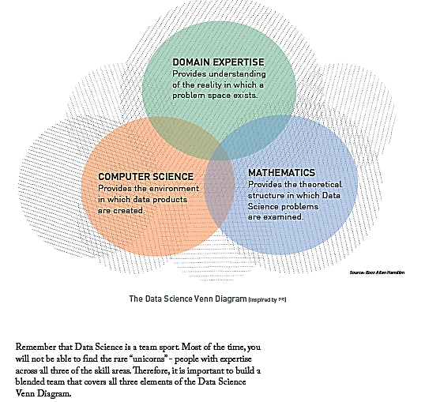
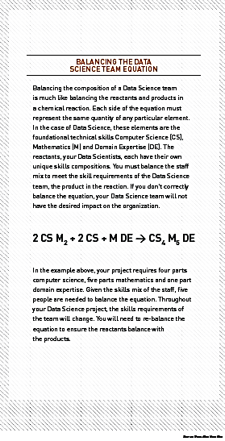
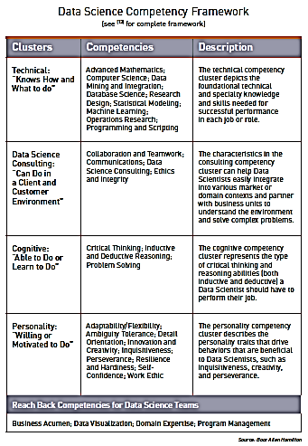
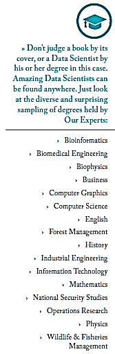
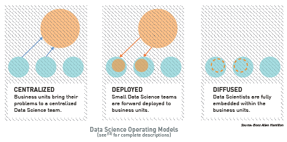

**What Does it Take to Create a Data Science Capability?**

\_\_\_\_\_\_\_\_\_\_\_\_\_\_\_\_\_\_\_\_\_\_\_\_\_\_\_\_\_\_\_\_\_\_\_\_\_\_\_\_\_\_\_\_\_\_\_\_\_\_\_\_\_\_\_\_\_\_\_\_\_\_\_\_\_\_\_\_\_\_\_\_\_\_\_\_\_\_\_\_\_\_\_\_\_\_\_\_\_\_\_\_\_\_\_\_\_\_\_\_\_\_\_\_\_\_\_\_\_\_\_\_\_\_

Data Science is all about building teams and culture.

\_\_\_\_\_\_\_\_\_\_\_\_\_\_\_\_\_\_\_\_\_\_\_\_\_\_\_\_\_\_\_\_\_\_\_\_\_\_\_\_\_\_\_\_\_\_\_\_\_\_\_\_\_\_\_\_\_\_\_\_\_\_\_\_\_\_\_\_\_\_\_\_\_\_\_\_\_\_\_\_\_\_\_\_\_\_\_\_\_\_\_\_\_\_\_\_\_\_\_\_\_\_\_\_\_\_\_\_\_\_\_\_\_\_

Many organizations (both commercial and government) see the potential in capitalizing on data to unlock operational efficiencies, to create new services and experiences, and to propel innovation. Unfortunately, too many business leaders invest in one-off technical solutions— with a big price tag and mixed results— instead of investing in building a strategic Data Science capability. A Data Science capability embeds and operationalizes Data Science across an enterprise such that it can deliver the next level of organizational performance and return on investment. A Data Science capability moves an organization beyond performing pockets of analytics to an enterprise approach that uses analytical insights as part of the normal course of business. When building a capability, it is important for an organization to first identify its analytic goals (i.e., what it is trying to achieve through analytics) and then assess its readiness to achieve those goals – examining both technical readiness and organizational readiness. An organization can then make strategic choices on how to address gaps and begin to build their capability.

**Building Your Data Science Team**

A critical component to any Data Science capability is having the right team. Data Science depends on a diverse set of skills as shown in The Data Science Venn Diagram. Computers provide the environment in which data-driven hypotheses are tested, and as such, computer science is necessary for data manipulation and processing. Mathematics provides the theoretical structure in which Data Science problems are examined. A rich background in statistics, geometry, linear algebra, and calculus are all important to understand the basis for many algorithms and tools. Finally, domain expertise contributes to an understanding of what problems actually need to be solved, what kind of data exists in the domain, and how the problem space may be instrumented and measured.

**Understanding What Makes a Data Scientist**

Data Science often requires a significant investment of time across a variety of tasks. Hypotheses must be generated and data must be acquired, prepared, analyzed, and acted upon. Multiple techniques are often applied before one yields interesting results. If that seems daunting, it is because it is. Data Science is difficult, intellectually taxing work, which requires lots of talent: both tangible technical skills as well as the intangible “x-factors.”

There are four independent yet comprehensive foundational Data Science competency clusters that, when considered together, convey the essence of what it means to be a successful Data Scientist. There are also reach back competencies that complement the foundational clusters but do not define the core tradecraft or attributes of the Data Science team.

The most important qualities of Data Scientists tend to be the intangible aspects of their personalities. Data Scientists are by nature curious, creative, focused, and detail-oriented.

-   ***Curiosity*** is necessary to peel apart a problem and examine the interrelationships between data that may appear superficially unrelated.

-   ***Creativity*** is required to invent and try new approaches to solving a problem, which often times have never been applied in such a context before.

-   ***Focus*** is required to design and test a technique over days and weeks, find it doesn’t work, learn from the failure, and try again.

-   ***Attention*** to Detail is needed to maintain rigor, and to detect and avoid over-reliance on intuition when examining data.

We have found the single most important attribute is flexibility in overcoming setbacks - the willingness to abandon one idea and try a new approach. Often, Data Science is a series of dead ends before, at last, the way forward is identified. It requires a unique set of personality attributes to succeed in such an environment. Technical skills can be developed over time: the ability to be flexible – and patient, and persistent – cannot.

**Finding the Athletes for Your Team**

Building a Data Science team is complex. Organizations must simultaneously engage existing internal staff to create an “anchor” who can be used to recruit and grow the team, while at the same time undergo organizational change and transformation to meaningfully incorporate this new class of employee. Building a team starts with identifying existing staff within an organization who have a high aptitude for Data Science. Good candidates will have a formal background in any of the three foundational technical skills we mentioned, and will most importantly have the personality traits necessary for Data Science. They may often have advanced (masters or higher) degrees, but not always. The very first staff you identify should also have good leadership traits and a sense of purpose for the organization, as they will lead subsequent staffing and recruiting efforts. Don’t discount anyone – you will find Data Scientists in the strangest places with the oddest combinations of backgrounds.

**Shaping the Culture**

It is no surprise—building a culture is hard and there is just as much art to it as there is science. It is about deliberately creating the conditions for Data Science to flourish (for both Data Scientists and the average employee). You can then step back to empower collective ownership of an organic transformation.

Data Scientists are fundamentally curious and imaginative. We have a saying on our team, “We’re not nosy, we’re Data Scientists.” These qualities are fundamental to the success of the project and to gaining new dimensions on challenges and questions. Often Data Science projects are hampered by the lack of the ability to imagine something new and different. Fundamentally, organizations must foster trust and transparent communication across all levels, instead of deference to authority, in order to establish a strong Data Science team. Managers should be prepared to invite participation more frequently, and offer explanation or apology less frequently.

It is important to provide a path into the Data Science “club” and to empower the average employee to feel comfortable and conversant with Data Science. For something to be part of organizational culture, it must be part of the fabric of the employee behavior. That means employees must interact with and use data products in their daily routines. Another key ingredient to shaping the right culture is that all employees need a baseline of Data Science knowledge, starting with a common lexicon, to facilitate productive collaboration and instill confidence. While not everyone will be Data Scientists, employees need to identify with Data Science and be equipped with the knowledge, skills, and abilities to work with Data Scientists to drive smarter decisions and deliver exponential organizational performance.

**Selecting Your Operating Model**

Depending on the size, complexity, and the business drivers, organizations should consider one of three Data Science operating models: Centralized, Deployed, or Diffused. These three models are shown in the figure, Data Science Operating Models.

***Centralized Data Science*** teams serve the organization across all business units. The team is centralized under a Chief Data Scientist and they all co-locate together. The domain experts come to this organization for brief rotational stints to solve challenges around the business. This model provides greater efficiency with limited Data Science resources but can also create the perceived need to compete with other business units for Data Science talent. To address this challenge, it is important to place emphasis on portfolio management and creating transparency on how organizations will identify and select Data Science projects.

***Deployed Data Science*** teams go to the business unit and reside there for short- or long-term assignments. They are their own entity and they work with the domain experts within the group to solve hard problems. In the deployed model, Data Science teams collectively develop knowledge across business units, with central leadership as a bridging mechanism for addressing organization -wide issues. However, Data Science teams are accountable to business unit leadership and their centralized leadership, which could cause confusion and conflict. In this model, it is important to emphasize conflict management to avoid competing priorities.

***The Diffused Data Science*** team is one that is fully embedded with each group and becomes part of the long-term organization. These teams work best when the nature of the domain or business unit is already one focused on analytics. In the Diffused Model, teams can quickly react to high-priority business unit needs. However, the lack of central management can result in duplicate software and tools. Additionally, business units with the most money will often have full access to analytics while other units have none—this may not translate to the greatest organizational impact. In this model, it is important to establish cross-functional groups that promote organization-wide governance and peer collaboration.

Full descriptions of each operating model can be found in Booz Allen’s Tips for Building a Data Science Capability \[13\].

**How to Generate Momentum**

A Data Science effort can start at the grass roots level by a few folks tackling hard problems, or as directed by the Chief Executive Officer, Chief Data Officer, or Chief Analytics Officer. Regardless of how an effort starts, political headwinds often present more of a challenge than solving any technical hurdles. To help battle the headwinds, it is important to generate momentum and prove the value a Data Science team can provide. The best way to achieve this is usually through a Data Science prototype or proof of concept. Proofs of concepts can generate the critical momentum needed to jump start any Data Science Capability Four qualities, in particular, are essential for every Data Science prototype:

1.  ***Organizational Buy-in:*** A prototype will only succeed if the individuals involved believe in it and are willing to do what they can to make it successful. A good way to gauge interest is to meet with the middle managers; their views are usually indicative of the larger group.

2.  ***Clear ROI:*** Before choosing a prototype problem, ensure that the ROI of the analytic output can be clearly and convincingly demonstrated for both the project and the organization as a whole. This outcome typically requires first reaching consensus on how the ROI will be determined and measured, so that the benefit can be quantified.

3.  ***Necessary Data:*** Before selecting a prototype, you must first determine exactly what data is needed, whether it will actually be available, and what it will cost in terms of time and expense. It is important to note that organizations do not need all the possible data – they can still create successful analytics even with some gaps.

4.  ***Limited Complexity and Duration:*** The problem addressed by the prototype should achieve a balance between being too complex and too easy. Organizations new to Data Science often try to show its value with highly complex projects. However, the greater the complexity, the greater the risk of failure. At the same time, if the problem is too easy to solve, senior leaders and others in the organization may not see the need for Data Science. Look for efforts that could benefit from large datasets, or bringing together disparate datasets that have never been combined before, as opposed to those that require complex analytic approaches. In these cases, there is often low-hanging fruit that can lead to significant value for the organization.

