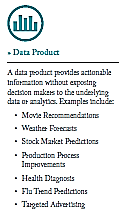
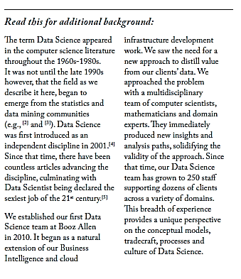
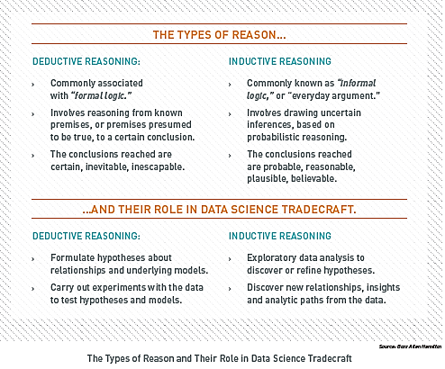
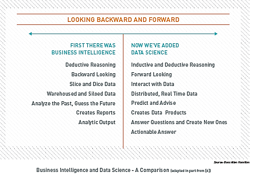

**What do We Mean by **

**Data Science?**

\_\_\_\_\_\_\_\_\_\_\_\_\_\_\_\_\_\_\_\_\_\_\_\_\_\_\_\_\_\_\_\_\_\_\_\_\_\_\_\_\_\_\_\_\_\_\_\_\_\_\_\_\_\_\_\_\_\_\_\_\_\_\_\_\_\_\_\_\_\_\_\_\_\_\_\_\_\_\_\_\_\_\_\_\_\_\_\_\_\_\_\_\_\_\_\_\_\_\_\_\_\_\_\_\_

Describing Data Science is like trying to describe a sunset – it should be easy, but somehow capturing the words is impossible.

\_\_\_\_\_\_\_\_\_\_\_\_\_\_\_\_\_\_\_\_\_\_\_\_\_\_\_\_\_\_\_\_\_\_\_\_\_\_\_\_\_\_\_\_\_\_\_\_\_\_\_\_\_\_\_\_\_\_\_\_\_\_\_\_\_\_\_\_\_\_\_\_\_\_\_\_\_\_\_\_\_\_\_\_\_\_\_\_\_\_\_\_\_\_\_\_\_\_\_\_\_\_\_\_\_

**Data Science Defined**

Data Science is the art of turning data into actions. This is accomplished through the creation of data products, which provide actionable information without exposing decision makers to the underlying data or analytics (e.g., buy/sell strategies for financial instruments, a set of actions to improve product yield, or steps to improve product marketing).

Performing Data Science requires the extraction of timely, actionable information from diverse data sources to drive data products. Examples of data products include answers to questions such as: “Which of my products should I advertise more heavily to increase profit? How can I improve my compliance program, while reducing costs? What manufacturing process change will allow me to build a better product?” The key to answering these questions is: understand the data you have and what the data inductively tells you.

**What makes Data Science Different?**

Data Science supports and encourages shifting between deductive (hypothesis-based) and inductive (pattern-based) reasoning. This is a fundamental change from traditional analytic approaches. Inductive reasoning and exploratory data analysis provide a means to form or refine hypotheses and discover new analytic paths. In fact, to do the discovery of significant insights that are the hallmark of Data Science, you must have the tradecraft and the interplay between inductive and deductive reasoning. By actively combining the ability to reason deductively and inductively, Data Science creates an environment where models of reality no longer need to be static and empirically based. Instead, they are constantly tested, updated and improved until better models are found. These concepts are summarized in the figure, The Types of Reason and Their Role in Data Science Tradecraft.

The differences between Data Science and traditional analytic approaches do not end at seamless shifting between deductive and inductive reasoning. Data Science offers a distinctly different perspective than capabilities such as Business Intelligence. Data Science should not replace Business Intelligence functions within an organization, however. The two capabilities are additive and complementary, each offering a necessary view of business operations and the operating environment. The figure, *Business Intelligence and* *Data Science – A Comparison,* highlights the differences between the two capabilities. Key contrasts include:

-   ***Discovery vs. Pre-canned Questions:*** Data Science actually works on discovering the question to ask as opposed to just asking it.

-   ***Power of Many vs. Ability of One:*** An entire team provides a common forum for pulling together computer science, mathematics and domain expertise.

-   ***Prospective vs. Retrospective:*** Data Science is focused on obtaining actionable information from data as opposed to reporting historical facts.

**What is the Impact of Data Science?**

As we move into the data economy, Data Science is the competitive advantage for organizations interested in winning – in whatever way winning is defined. The manner in which the advantage is defined is through improved decision-making. A former colleague liked to describe data- informed decision making like this: *If you have perfect* *information or zero information then your task is easy – it is in between those two extremes that the trouble begins.* What he was highlighting is the stark reality that whether or not information is available, decisions must be made.

The way organizations make decisions has been evolving for half a century. Before the introduction of Business Intelligence, the only options were gut instinct, loudest voice, and best argument. Sadly, this method still exists today, and in some pockets it is the predominant means by which the organization acts. Take our advice and never, ever work for such a company!

Fortunately for our economy, most organizations began to inform their decisions with real information through the application of simple statistics. Those that did it well were rewarded; those that did not failed. We are outgrowing the ability of simple stats to keep pace with market demands, however. The rapid expansion of available data and the tools to access and make use of the data at scale are enabling fundamental changes to the way organizations make decisions.

Data Science is required to maintain competitiveness in the increasingly data -rich environment. Much like the application of simple statistics, organizations that embrace Data Science will be rewarded while those that do not will be challenged to keep pace. As more complex, disparate datasets become available, the chasm between these groups will only continue to widen. The figure, *The Business* *Impacts of Data Science,* highlights the value awaiting organizations that embrace Data Science.

**What is Different Now?**

For 20 years IT systems were built the same way. We separated the people who ran the business from the people who managed the infrastructure (and therefore saw data as simply another thing they had to manage). With the advent of new technologies and analytic techniques, this artificial – and highly ineffective – separation of critical skills is no longer necessary. For the first time, organizations can directly connect business decision makers to the data. This simple step transforms data from being ‘something to be managed’ into ‘something to be valued.’

In the wake of the transformation, organizations face a stark choice: you can continue to build data silos and piece together disparate information or you can consolidate your data and distill answers.

From the Data Science perspective, this is a false choice: The siloed approach is untenable when you consider the (a) the opportunity cost of not making maximum use of all available data to help an organization succeed, and (b) the resource and time costs of continuing down the same path with outdated processes. The tangible benefits of data products include:

-   ***Opportunity Costs:*** Because Data Science is an emerging field, opportunity costs arise when a competitor implements and generates value from data before you. Failure to learn and account for changing customer demands will inevitably drive customers away from your current offerings. When competitors are able to successfully leverage Data Science to gain insights, they can drive differentiated customer value propositions and lead their industries as a result.

-   ***Enhanced Processes:*** As a result of the increasingly interconnected world, huge amounts of data are being generated and stored every instant. Data Science can be used to transform data into insights that help improve existing processes. Operating costs can be driven down dramatically by effectively incorporating the complex interrelationships in data like never before. This results in better quality assurance, higher product yield and more effective operations.
