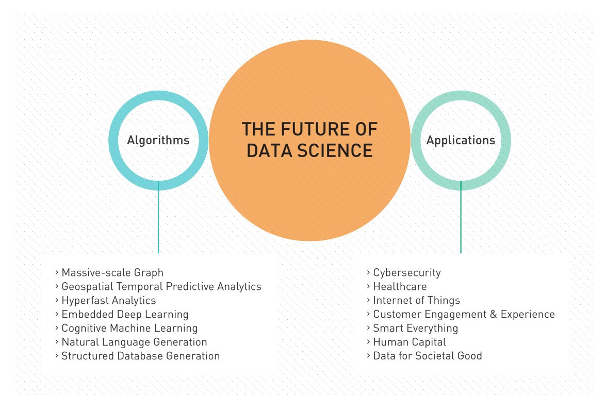

#The Future of Data Science

Author: Kirk Borne

Data Science is rapidly evolving as it touches every aspect of our lives on a daily basis. As Data Science changes the way we interact with, and explore our world, the algorithms and applications of Data Science continue to advance. We expect this trend to continue as Data Science has an increasingly profound effect on humanity. We describe here some of the trends and developments we anticipate emerging in the field of Data Science over the coming years. 

The advancements in some Data Science algorithms will deliberately track the evolution of data structures and data models that Data Scientists are using to represent their domains of study. One of the clearest examples of this linkage is in the development of massivescale graph analytics algorithms, which are deployed on graph databases (including network data and semantically linked databases). It is sometimes said “all the world is a graph,” and consequently the most natural data structure is not a table with rows and columns, but a network graph with nodes and edges. Graph analytics encompasses traditional methods of machine learning, but with a graph-data twist. 

Another growth area in Data Science algorithms is in the domain of geospatial temporal predictive analytics, which can be applied to any dataset that involves geospatial location and time – that describes just about everything in our lives! We expect increasingly sophisticated deployments of this methodology in the areas of law enforcement, climate change, disaster management, population health, sociopolitical change, and more. 

It is obvious that bigger, faster, and more complex datasets will require faster (hyperfast!) analytics. We anticipate advanced Data Science algorithms that take advantage of technological advancements in quantum machine-learning, in-memory data operations, and machine learning on specialized devices (e.g., the GPU, Raspberry Pi, or the next-generation mobile handheld “supercomputer”). In such commodity devices, we expect to see development of more embedded machine learning (specifically, deep learning) algorithms that perform time-critical data-to-insights transformations at the point of data collection. Such use cases will be in great abundance within the emerging Internet of Things (IoT), including the industrial IoT and the internet of everything. 

Advances in cognitive machine learning are on the horizon, including open source and configurable algorithms that exploit streaming real-time data’s full content, context, and semantic meaning. The ability to use the 360-degree view of a situation will enable the delivery of the right action, at the right time, at the right place, in the right context – this is the essence of cognitive analytics. Another way to view cognitive analytics is that, given all of the data and the context for a given object or population, the algorithm identifies the right question that you should be asking of your data (which might not be the question that you traditionally asked). 

Another area of Data Science evolution that tracks with the growth in a particular data type is that of unstructured data, specifically text. The growth of such unstructured data is phenomenal, and demands richer algorithms than those used on numerical data, since there are many more shades of meaning in natural language than in tables of numbers. The new Data Science algorithms for unstructured data will be applied in multiple directions. Natural Language Generation will be used to convert data points into text, which can be used to generate the data’s story automatically. Structured Database Generation will transform text documents or other unstructured data into data points (i.e., converting qualitative data into machinecomputable quantitative data). 

All of these technical advancements, plus others that we cannot yet imagine, will be brought to bear on new domains. Some of the hottest, most critical domains in which Data Science will be applied in the coming years include: 

›› Cybersecurity including advanced detection, modeling, prediction, and prescriptive analytics 

›› Healthcare including genomics, precision medicine, population health, healthcare delivery, health data sharing and integration, health record mining, and wearable device analytics 

›› IoT including sensor analytics, smart data, and emergent discovery alerting and response 

›› Customer Engagement and Experience including 360-degree view, gamification, and just-in-time personalization 

›› Smart X, where X = cities, highways, cars, delivery systems, supply chain, and more 

›› Precision Y, where Y = medicine, farming, harvesting, manufacturing, pricing, and more 

›› Personalized Z, where Z = marketing, advertising, healthcare, learning, and more 

›› Human capital (talent) and organizational analytics 

›› Societal good

