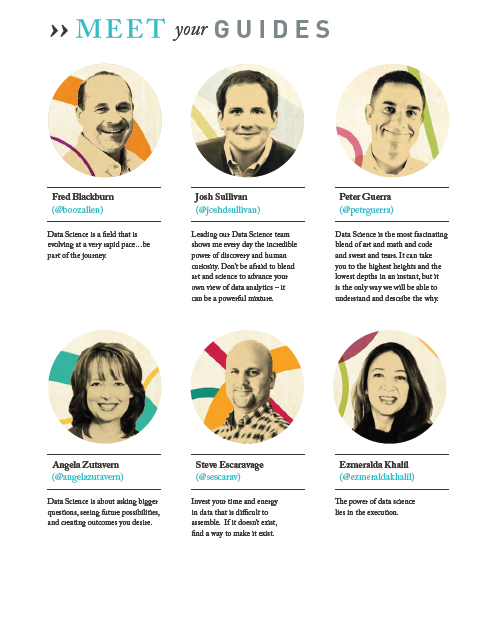
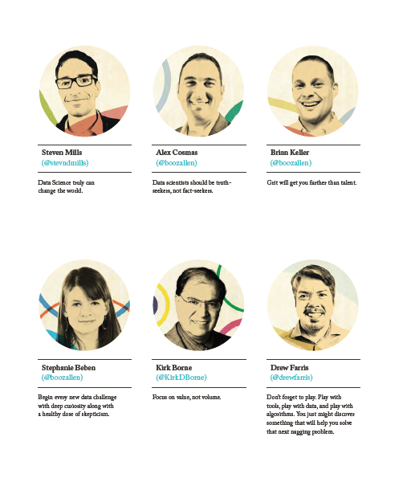
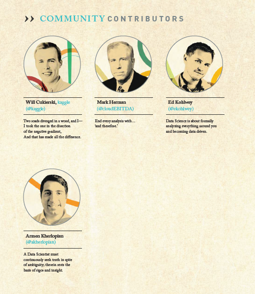

**Fred Blackburn** (@boozallen)
Data Science is a field that is evolving at a very rapid pace...be part of the journey.

**Angela Zutavern** (@angelazutavern)
Data Science is about asking bigger questions, seeing future possibilities, and creating outcomes you desire.

**Josh Sullivan** (@joshdsullivan)
Leading our Data Science team shows me every day the incredible power of discovery and human curiosity. Don't be afraid to blend art and science to advance your own view of data analytics – it can be a powerful mixture.

**Steve Escaravage**(@sescarav)
Invest your time and energy in data that is difficult to assemble. If it doesn’t exist, find a way to make it exist.

**Peter Guerra** (@petrguerra)
Data Science is the most fascinating blend of art and math and code and sweat and tears. It can take you to the highest heights and the lowest depths in an instant, but it is the only way we will be able to understand and describe the why. 

**Ezmeralda Khalil** (@ezmeraldakhalil)
The power of data science lies in the execution.

**Steven Mills** (@stevndmills)
Data Science can truly change the world.

**Stephanie Beben**(@boozallen)
Begin every new data challenge with deep curiosity along with a healthy dose of skepticism.

**Alex Cosmas**(@boozallen)
Data scientists should be truthseekers, not fact-seekers.

**Kirk Borne**(@KirkDBorne)
Focus on value, not volume.

**Brian Keller**(@boozallen)
Grit will get you farther than talent.

**Drew Farris**(@drewfarris)
Don’t forget to play. Play with tools, play with data, and play with algorithms. You just might discover something that will help you solve that next nagging problem.

**Paul Yacci**(@paulyacci)
In the jungle of data, don't miss the forest for the trees, or the trees for the forest.

**Stephanie Rivera** (@boozallen)
I treat Data Science like I do rock climbing: awesome dedication leads to incremental improvement. Persistence leads to the top.

**Charles Glover** (@MindAfterMath)
The beauty of data science lies in satisfying curiosities about important problems by playing with data and algorithms.

**Aaron Sander** (@ajsander)
Data science is changing corporate culture to be more like the open source environment. More open, more collaborative, and faster paced.

**Michael Kim** (@boozallen)
Data science is both an art and science.

We would like to thank the following people for their contributions and edits: Tim Andrews, Mike Delurey, Greg Dupier, Jason Escaravage, Christine Fantaskey, Juergen Klenk, Dan Liebermann, Mark Rockley and Katie Wilks.

#Community Contributors

**Will Cukierski**, kaggle (@kaggle)
Two roads diverged in a wood, and I—I took the one in the direction of the negative gradient, And that has made all the difference.

**Armen Kherlopian** (@akherlopian)
A Data Scientist must continuously seek truth in spite of ambiguity; therein rests the basis of rigor and insight.

**Mark Herman** (@cloudEBITDA)
End every analysis with...‘and therefore.’

**Ed Kohlwey** (@ekohlwey)
Data Science is about formally analyzing everything around you and becoming data driven.

