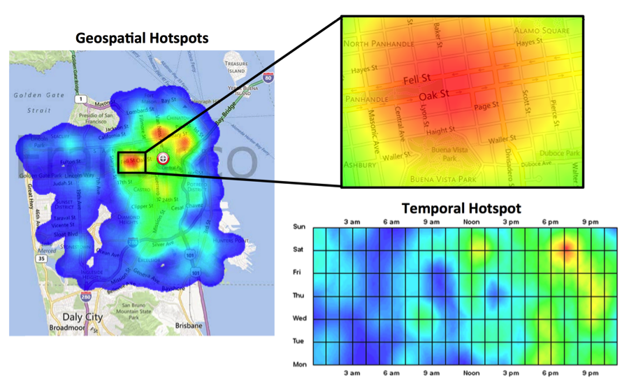

###Application of Domain Knowledge Case Study -- Motor Vehicle Theft
*Author: Armen Kherlopian, Booz Allen Data Scientist*

On one project, our team explored how Data Science could be applied to improve public safety. According to the FBI, approximately $8 Billion is lost annually due to automobile theft. Recovery of the one million vehicles stolen every year in the U.S is less than 60%. Dealing with these crimes represents a significant investment of law enforcement resources. We wanted to see if we could identify how to reduce auto theft while efficiently using law enforcement resources.

Our team began by parsing and verifying San Francisco crime data. We enriched stolen car reporting with general city data. After conducting several data experiments across both space and time, three geospatial and one temporal hotspot emerged (see figure, Geospatial and Temporal Car Theft Hotspots). The domain expert on the team was able to discern that the primary geospatial hotspot corresponded to an area surrounded by parks. The parks created an urban mountain with a number of over-foot access points that were conducive to car theft.

Figure: Geospatial and Temporal Car Theft Hotspots

Our team used the temporal hotspot information in tandem with the insights from the domain expert to develop a Monte Carlo model to predict the likelihood of a motor vehicle theft at particular city intersections. By prioritizing the intersections identified by the model, local governments would have the information necessary to efficiently deploy their patrols. Motor vehicle thefts could be reduced and law enforcement resources could be more efficiently deployed. This analysis, enabled by domain expertise, yielded actionable insights that could make the streets safer.
