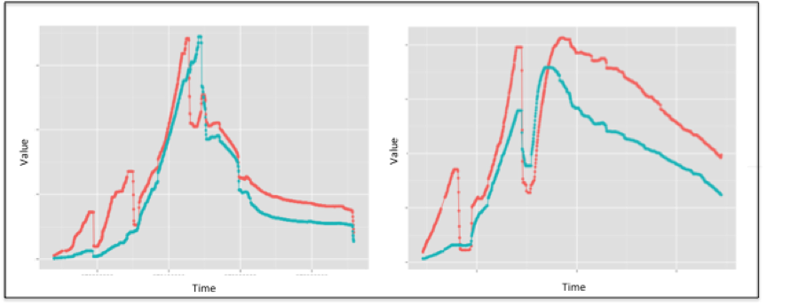

###Data Veracity Case Study -- Time Series Modeling
*Author: Brian Keller, Booz Allen Data Scientist*

On one of our projects, the team was faced with correlating the time series for various parameters. Our initial analysis revealed that the correlations were almost non-existent. We examined the data and quickly discovered data veracity issues. There were missing and null values, as well as negative-value observations, an impossibility given the context of the measurements (see the figure, Time Series Data Prior to Cleansing). Garbage data meant garbage results.

<figure align="center">

<figcaption>Figure: Time Series Data Prior to Cleansing</figcaption>
</figure>
Because sample size was already small, deleting observations was undesirable. The volatile nature of the time series meant that imputation through sampling could not be trusted to produce values in which the team would be confident. As a result, we quickly realized that the best strategy was an approach that could filter and correct the noise in the data. 

We initially tried a simplistic approach in which we replaced each observation with a moving average. While this corrected some noise, including the outlier values in our moving-average computation shifted the time series. This caused undesirable distortion in the underlying signal, and we quickly abandoned the approach.

One of our team members who had experience in signal processing suggested a median filter. The median filter is a windowing technique that moves through the data point-by-point, and replaces it with the median value calculated for the current window. We experimented with various window sizes to achieve an acceptable tradeoff between smoothing noise and smoothing away signal. The figure, Time Series Data After Cleansing, shows the same two time series after median filter imputation.

<figure>

<figcaption>Figure: Time Series Data After Cleansing</figcaption>
</figure>

The application of the median filter approach was hugely successful. Visual inspection of the time series plots reveals smoothing of the outliers without dampening the naturally occurring peaks and troughs (no signal loss). Prior to smoothing, we saw no correlation in our data, but afterwards, Spearman’s Rho was ~0.5 for almost all parameters. By addressing our data veracity issues, we were able to create analytic gold. While other approaches may also have been effective, implementation speed constraints prevented us from doing any further analysis. We achieved the success we were after and moved on to address other aspects of the problem. 

<I>(TIP: Find an approach that works, implement it, and move on. You can worry about optimization and tuning your approaches later during incremental improvement.) </I>
