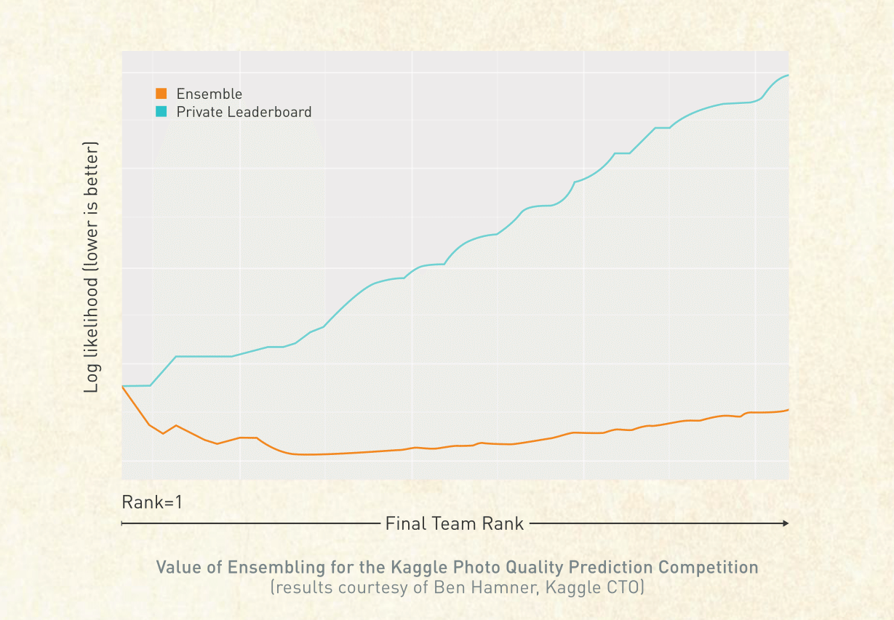

The Value of Ensemble Models
============================

Author: Will Cukierski

Several years ago, the Kaggle Photo Quality Prediction competition posed the question “Given anonymized information on thousands of photo albums, predict whether a human evaluator would mark them as 'good'.” Participants were supplied a large collection of user-generated photos. The goal was to create an algorithm that could automatically pick out particularly enjoyable or impressive photos from the collection. 

Over the course of the competition, 207 people submitted entries. The log likelihood metric was used to evaluate the accuracy of the entries. Scores for the top 50 teams ranged from 0.18434 to 0.19884, where lower is better. Kaggle data scientist Ben Hamner used the results to illustrate the value of ensembling by means of averaging the top 50 scores. The figure below shows the results. 

The blue line shows the individual scores for each of the top 50 teams. The orange line shows the ensembled score for the top n teams, where n ranges from 1 to the value on the axis. For example, the ensemble point for Final Team Rank 5 is an ensemble of the entries for teams 1 through 5. As shown in the graph, the ensembled score is lower than any single individual score. The diversity of models included within the ensemble causes the respective errors to cancel out, resulting in an overall lower score. This holds true for all points across the top 50 teams. However, after we increase the number of models in the ensemble beyond 15, we begin to see the ensembled score increase. This occurs because we are introducing less accurate (i.e., potentially overfit) models into the ensemble. The results of this simple experiment quantify the value of creating an ensemble model, while reinforcing the idea that we must be thoughtful when selecting the individual models contained within the ensemble.
