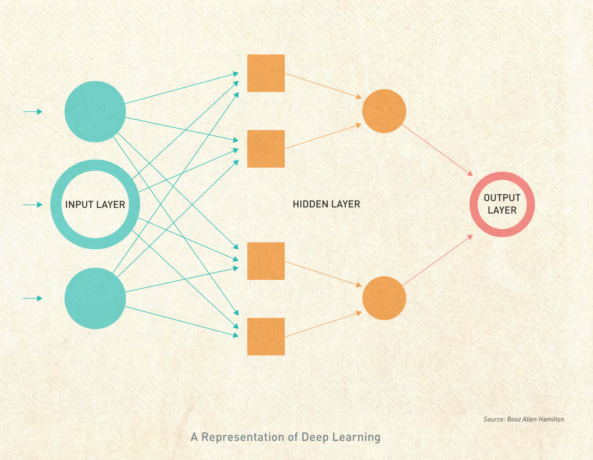

National Data Science Bowl
==========================

The first-ever National Data Science Bowl offered Data Scientists a platform through which individuals could harness their passion, unleash their curiosity and amplify their impact to affect change on a global scale. The competition presented participants with more than 100,000 underwater images provided by the Hatfield Marine Science Center. Participants were challenged to develop a classification algorithm that would enable researchers to monitor ocean health at a speed and scale never before possible. 

More than 1,000 teams submitted a total of approximately 15,000 solutions over the 90 days of the competition. A large proportion of the participants’ implemented solutions used deep learning-based approaches, specifically Convolutional Neural Nets (CNNs). The competition forum exploded with competitors collectively sharing knowledge and collaborating to advance the state-of-the-art in computer vision. Participants tested new techniques for developing CNNs and contributed to the development of open source software for creating CNN models. The top three competitors, Team Deep Sea, Happy Lantern Festival, and Poisson Process, all used CNNs in their solutions. Their results increased algorithm accuracy by 10% over the state of the art. Without their algorithms, it would have taken marine researchers more than two lifetimes to manually complete the classification process. The work submitted by all the participants represents major advances for both the marine research and Data Science communities.

**Visit www.DataScienceBowl.com to learn more about the first-ever National Data Science Bowl.**

