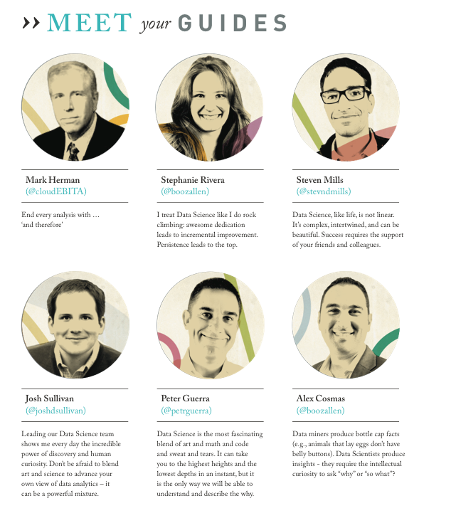
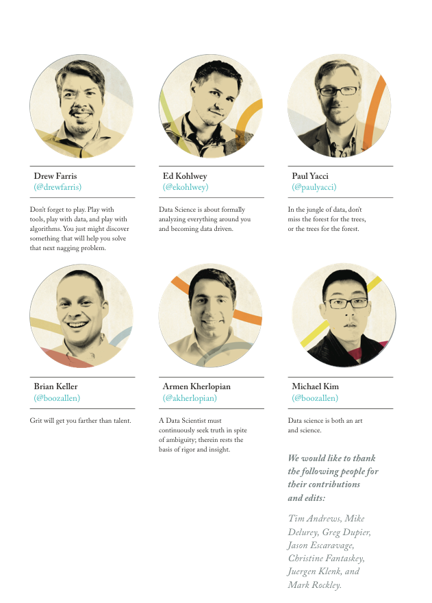

**Mark Herman** (@cloudEBITA)
End every analysis with … ’and therefore’

**Josh Sullivan** (@joshdsullivan)
Leading our Data Science team shows me every day the incredible power of discovery and human curiosity. Don't be afraid to blend art and science to advance your own view of data analytics – it can be a powerful mixture.

**[Stephanie Rivera](https://mentally-physically-spiritually-strong.com/)** (@boozallen)
I treat Data Science like I do rock climbing: awesome dedication leads to incremental improvement. Persistence leads to the top.

**Peter Guerra** (@petrguerra)
Data Science is the most fascinating blend of art and math and code and sweat and tears. It can take you to the highest heights and the lowest depths in an instant, but it is the only way we will be able to understand and describe the why. 

**Steven Mills** (@stevndmills)
Data Science, like life, is not linear. It’s complex, intertwined, and can be beautiful. Success requires the support of your friends and colleagues. 

**Alex Cosmas** (@boozallen)
Data miners produce bottle cap facts (e.g., animals that lay eggs don't have belly buttons). Data Scientists produce insights - they require the intellectual curiosity to ask "why" or "so what"?

**Drew Farris** (@drewfarris)
Don't forget to play. Play with tools, play with data, and play with algorithms. You just might discover something that will help you solve that next nagging problem.

**Brian Keller** (@boozallen)
Grit will get you farther than talent.

**Ed Kohlwey** (@ekohlwey)
Data Science is about formally analyzing everything around you and becoming data driven.

**Armen Kherlopian** (@akherlopian)
A Data Scientist must continuously seek truth in spite of ambiguity; therein rests the basis of rigor and insight.

**Paul Yacci** (@paulyacci)
In the jungle of data, don't miss the forest for the trees, or the trees for the forest.

**Mike Kim** (@booxallen)
Data Science is both art and science.

We would like to thank the following people for their contributions and edits: Tim Andrews, Mike Delurey, Greg Dupier, Jason Escaravage, Christine Fantaskey, Juergen Klenk, and Mark Rockley.

