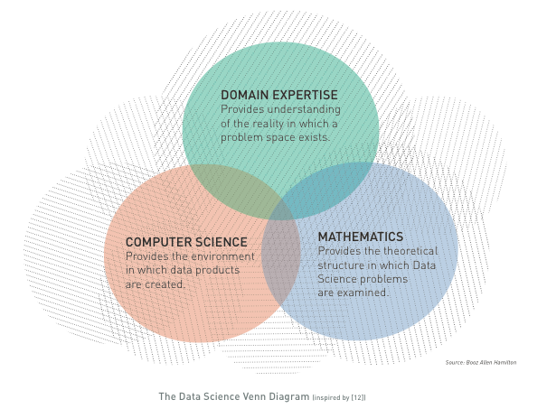
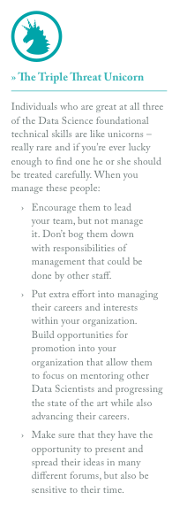
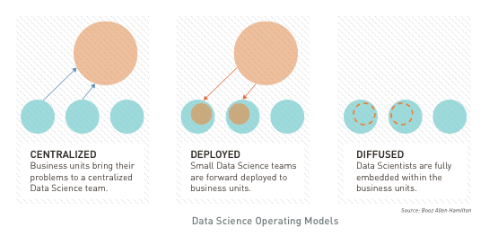
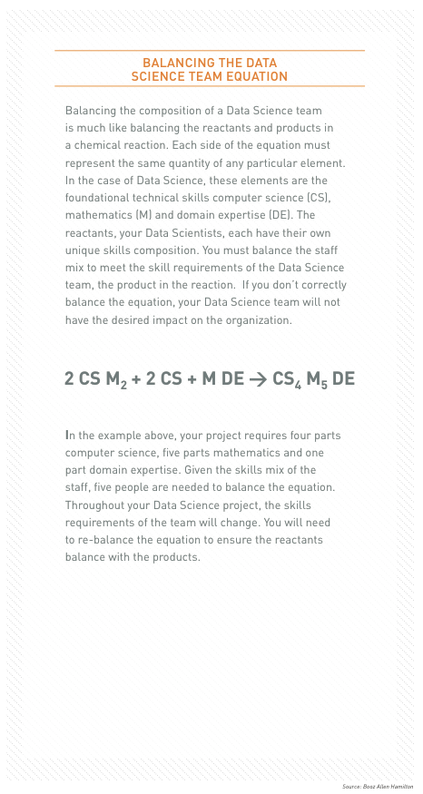

## What does it take to create a Data Science capability?

*Data Science is all about building teams and culture.*

As with any team sport, Data Science depends on a diverse set of skills to achieve its objective – winning at the game of improved insights. You need the three skill sets shown in The Data Science Venn Diagram to create a winning team in the world of Data Science.

Building Data Science teams is difficult. It requires an understanding of the types of personalities that make Data Science possible, as well as a willingness to establish a culture of innovation and curiosity in your organization. You must also consider how to deploy the team and gain widespread buy-in from across your organization.

### UNDERSTANDING WHAT MAKES A DATA SCIENTIST
Data Science often requires a significant investment of time across a variety of tasks. Hypotheses must be generated and data must be identified, gathered, processed and analyzed. Multiple techniques are often applied before one yields interesting results. If that seems daunting, it is because it is. Data Science is difficult, intellectually taxing work, which requires lots of talent: both tangible technical skills as well as the intangible ‘x-factors.’

The most important qualities of Data Scientists tend to be the intangible aspects of their personalities. Data Scientists are by nature curious, creative, focused, and detail-oriented.

-	Curiosity is necessary to peel apart a problem and examine the interrelationships between data that may appear superficially unrelated. 
-	Creativity is required to invent and try new approaches to solving a problem, which often times have never been applied in such a context before. 
-	Focus is required to design and test a technique over days and weeks, find it doesn’t work, learn from the failure, and try again.
-	Attention to Detail is needed to maintain rigor, and to detect and avoid over-reliance on intuition when examining data.

Success of a Data Science team requires proficiency in three foundational technical skills: computer science, mathematics and domain expertise, as reflected in *The Data Science Venn Diagram*. Computers provide the environment in which data-driven hypotheses are tested, and as such computer science is necessary for data manipulation and processing. Mathematics provides the theoretical structure in which Data Science problems are examined. A rich background in statistics, geometry, linear algebra, and calculus are all important to understand the basis for many algorithms and tools. Finally, domain expertise contributes to an understanding of what problems actually need to be solved, what kind of data exists in the domain and how the problem space may be instrumented and measured.

### FINDING THE ATHLETES FOR YOUR TEAM
Building a Data Science team is complex. Organizations must simultaneously engage existing internal staff to create an “anchor” that can be used to recruit and grow the team, while at the same time undergo organizational change and transformation to meaningfully incorporate this new class of employee.

Building a team starts with identifying existing staff within an organization who have a high aptitude for Data Science. Good candidates will have a formal background in any of the three foundational technical skills we mentioned, and will most importantly have the personality traits necessary for Data Science. They may often have advanced (masters or higher) degrees, but not always. The very first staff you identify should also have good leadership traits and a sense of purpose for the organization, as they will lead subsequent staffing and recruiting efforts. Don’t discount anyone – you will find Data Scientists in the strangest places with the oddest combinations of backgrounds.

### SHAPING THE CULTURE
Good Data Science requires a highly academic culture of peer review, where no member of the organization is immune from constructive criticism. As you build your Data Science practice, you should be prepared to subject all aspects of your corporate operations to the curious nature of your Data Science teams. Failure to do so creates a negative image of a culture that fails to “eat its own dog food,” and will invite negative reflection on the brand, both internally and externally. You should be conscious of any cultural legacies existing in an organization that are antithetical to Data Science. 

Data Scientists are fundamentally curious and imaginative. We have a saying on our team, “We’re not nosey, we’re Data Scientists.” These qualities are fundamental to the success of the project and to gaining new dimensions on challenges and questions. Often Data Science projects are hampered by the lack of the ability to imagine something new and different. Fundamentally, organizations must foster trust and transparent communication across all levels, instead of deference to authority, in order to establish a strong Data Science team. Managers should be prepared to invite participation more frequently, and offer explanation or apology less frequently.

### SELECTING YOUR OPERATING MODEL
Depending on the size, complexity, and the business drivers, organizations should consider one of three Data Science operating models: Centralized, Deployed, or Diffused. These three models are shown in the figure, *Data Science Operating Models*.

Centralized Data Science teams serve the organization across all business units. The team is centralized under a Chief Data Scientist. They serve all the analytical needs of an organization and they all co-locate together. The domain experts come to this organization for brief rotational stints to solve challenges around the business. 

Deployed Data Science teams go to the business unit or group and reside there for short- or long-term assignments. They are their own entity and they work with the domain experts within the group to solve hard problems. They may be working independently on particular challenges, but they should always collaborate with the other teams to exchange tools, techniques and war stories. 

The Diffused Data Science team is one that is fully embedded with each group and becomes part of the long-term organization. These teams work best when the nature of the domain or business unit is already one focused on analytics. However, building a cross-cut view into the team that can collaborate with other Data Science teams is critical to the success. 

### SUCCESS STARTS AT THE TOP
Data Science teams, no matter how they are deployed, must have sponsorship. These can start as grass roots efforts by a few folks to start tackling hard problems, or as efforts directed by the CEO. Depending on the complexity of the organization, direction from top-down for large organizations is the best for assuaging fears and doubts of these new groups. 

Data Science teams often face harder political headwinds when solving problems than any technical hurdles. To prove a Data Science team’s value, the team needs to initially focus on the hardest problems within an organization that have the highest return for key stakeholders and will change how the organization approaches challenges in the future. This has the effect of keeping the team motivated and encouraged in the face of difficult challenges. Leaders must be key advocates who meet with stakeholders to ferret out the hardest problems, locate the data, connect disparate parts of the business and gain widespread buy-in.

