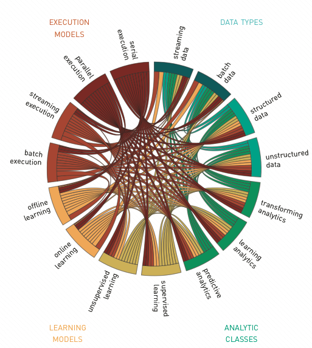
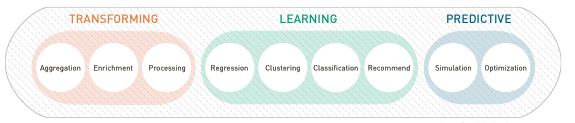
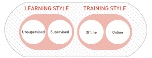
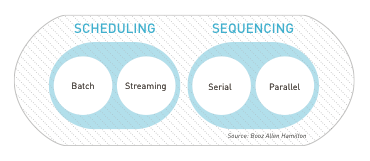

##COMPONENT PARTS OF DATA SCIENCE

###There is a web of components that interact to create your solution space. Understanding how they are connected is critical to your ability to engineer solutions to Data Science problems.

The components involved in any Data Science project fall into a number of different categories including the data types analyzed, the analytic classes used, the learning models employed and the execution models used to run the analytics. The interconnection across these components, shown in the figure, Interconnection Among the Component Parts of Data Science, speaks to the complexity of engineering Data Science solutions. A choice made for one component exerts influence over choices made for others categories. For example, data types lead the choices in analytic class and learning models, while latency, timeliness and algorithmic parallelization strategy inform the execution model. As we dive deeper into the technical aspects of Data Science, we will begin with an exploration of these components and touch on examples of each. 

 

 
->Interconnection Among the Component Parts of Data Science  <-

###DATA TYPES
Data types and analytic goals go hand-in-hand much like the chicken and the egg; it is not always clear which comes first. Analytic goals are derived from business objectives, but the data type also influences the goals. For example, the business objective of understanding consumer product perception drives the analytic goal of sentiment analysis. Similarly, the goal of sentiment analysis drives the selection of a text-like data type such as social media content. Data type also drives many other choices when engineering your solutions. 

There are a number of ways to classify data. It is common to characterize data as structured or unstructured. Structured data exists when information is clearly broken out into fields that have an explicit meaning and are highly categorical, ordinal or numeric. A related category, semi-structured, is sometimes used to describe structured data that does not conform to the formal structure of data models associated with relational databases or other forms of data tables, but nonetheless contains tags or other markers. Unstructured data, such as natural language text, has less clearly delineated meaning. Still images, video and audio often fall under the category of unstructured data. Data in this form requires preprocessing to identify and extract relevant 'features.’ The features are structured information that are used for indexing and retrieval, or training classification, or clustering models. 

Data may also be classified by the rate at which it is generated, collected or processed. The distinction is drawn between streaming data that arrives constantly like a torrent of water from a fire hose, and batch data, which arrives in buckets. While there is rarely a connection between data type and data rate, data rate has significant influence over the execution model chosen for analytic implementation and may also inform a decision of analytic class or learning model.

###CLASSES OF ANALYTIC TECHNIQUES
As a means for helping conceptualize the universe of possible analytic techniques, we grouped them into nine basic classes. Note that techniques from a given class may be applied in multiple ways to achieve various analytic goals. Membership in a class simply indicates a similar analytic function. The nine analytic classes are shown in the figure, Classes of Analytic Techniques.

 
 
->Classes of Analytic Techniques<-

#####•	Transforming Analytics  

*   Aggregation: Techniques to summarize the data. These include basic statistics (e.g., mean, standard deviation), distribution fitting, and graphical plotting.

*	Enrichment: Techniques for adding additional information to the data, such as source information or other labels.
*	Processing: Techniques that address data cleaning, preparation, and separation. This group also includes common algorithm pre-processing activities such as transformations and feature extraction.

#####Learning Analytics
*	Regression: Techniques for estimating relationships among variables, including understanding which variables are important in predicting future values.
*	Clustering: Techniques to segment the data into naturally similar groups.
*	Classification: Techniques to identify data element group membership.
*	Recommendation: Techniques to predict the rating or preference for a new entity, based on historic preference or behavior.  

#####Predictive Analytics
*    Simulation: Techniques to imitate the operation of a real-world process or system. These are useful for predicting behavior under new conditions.

*    Optimization: Operations Research techniques focused on selecting the best element from a set of available alternatives to maximize a utility function.

###LEARNING MODELS
Analytic classes that perform predictions such as: regression, clustering, classification, and recommendation employ learning models. These models characterize how the analytic is trained to perform judgments on new data based on historic observation. Aspects of learning models describe both the types of judgments performed and how the models evolve over time, as shown in the figure, Analytic Learning Models.

    

  
->Analytic Learning Models<-

The learning models are typically described as employing unsupervised or supervised learning. Supervised learning takes place when a model is trained using a labeled data set that has a known class or category associated with each data element. The model relates the features found in training instances with the labels so that predictions can be made for unlabeled instances. Unsupervised learning models have no a-priori knowledge about the classes into which data can be placed. They use the features in the dataset to form groupings based on feature similarity. 

A useful distinction of learning models is between those that are trained in a single pass, which are known as offline models, and those that are trained incrementally over time, known as online models. Many learning approaches have online or offline variants. The decision to use one or another is based on the analytic goals and execution models chosen.

Generating an offline model requires taking a pass over the entire training data set. Improving the model requires making separate passes over the data. These models are static in that once trained, their predictions will not change until a new model is created through a subsequent training stage. Offline model performance is easier to evaluate due to this deterministic behavior. Deployment of the model into a production environment involves swapping out the old model for the new. 

Online models dynamically evolve over time, meaning they only require a single deployment into a production setting. The fact that these models do not have the entire dataset available when being trained is a challenge. They must make assumptions about the data based on the examples observed; these assumptions may be suboptimal. The impact of sub-optimal predictions can be mitigated in cases where feedback on the model’s predictions is available. Online models can rapidly incorporate feedback to improve performance.

One such training style is known as Reinforcement Learning. Under this approach, an algorithm takes action in an environment and incrementally learns how to achieve goals based on the response to a function used to determine the quality of its results. Reinforcement learning is generally applicable to complex, real-world tasks that involve optimization, such as navigation or trading. Due to the publication of many promising results from Reinforcement Learning algorithms, the popularity of this technique has risen dramatically inrecent years along with Deep Learning.

#Reinforcement Learning Models in Action

The possibilities of Reinforcement Learning captured significant attention with the publication of a study in the journal Nature in which a computer agent learned to play 49 different video games with accuracy rivaling a professional game tester [14]. The agent was able to achieve these	results using only the raw screen pixels and game score as input. This	approach represents the first artificial intelligence agent that is capable of learning complex tasks while bridging between high-dimensional sensory inputs and actions.

###EXECUTION MODELS
Execution models describe how data is manipulated to perform an analytic function. They may be categorized across a number of dimensions. Execution Models are embodied by an execution framework, which orchestrates the sequencing of analytic computation. In this sense, a framework might be as simple as a programming language runtime, such as the Python interpreter, or a distributed computing framework that provides a specific API for one or more programming languages such as Hadoop, MapReduce or Spark. Grouping execution models based on how they handle data is common, classifying them as either batch or streaming execution models. The categories of execution model are shown in the figure, Analytic Execution Models.

 

 

->Analytic Execution Models<-

A batch execution model implies that data is analyzed in large segments, that the analytic has a state where it is running and a state where it is not running and that little state is maintained in memory between executions. Batch execution may also imply that the analytic produces results with a frequency on the order of several minutes or more. Batch workloads tend to be fairly easy to conceptualize because they represent discrete units of work. As such, it is easy to identify a specific series of execution steps as well as the proper execution frequency and time bounds based on the rate at which data arrives. Depending on the algorithm choice, batch execution models are easily scalabe through parallelism. There are a number of frameworks that support parallel batch analytic execution. Most famously, Hadoop provides a distributed batch execution model in its MapReduce framework.

Conversely, a streaming model analyzes data as it arrives. Streaming execution models imply that under normal operation, the analytic is always executing. The analytic can hold state in memory and constantly deliver results as new data arrives, on the order of seconds or less. Many of the concepts in streaming are inherent in the Unix-pipeline design philosophy; processes are chained together by linking the output of one process to the input of the next. As a result, many developers are already familiar with the basic concepts of streaming. A number of frameworks are available that support the parallel execution of streaming analytics such as Storm, S4 and Samza. (TIP: In order to understand system capacity in the context of streaming analytic execution, collect metrics including: the amount of data consumed, data emitted, and latency. This will help you understand when scale limits are reached.)

The choice between batch and streaming execution models often hinges on analytic latency and timeliness requirements. Latency refers to the amount of time required to analyze a piece of data once it arrives at the system, while timeliness refers to the average age of an answer or result generated by the analytic system. For many analytic goals, a latency of hours and timeliness of days is acceptable and thus lend themselves to the implementation enabled by the batch approach. Some analytic goals have up-to-the-second requirements where a result that is minutes old has little worth. The streaming execution model better supports such goals.

Batch and streaming execution models are not the only dimensions within which to categorize analytic execution methods. Another distinction is drawn when thinking about scalability. In many cases, scale can be achieved by spreading computation over a number of computers. In this context, certain algorithms require a large shared memory state, while others are easily parallelizable in a context where no shared state exists between machines. This distinction has significant impacts on both software and hardware selection when building out a parallel analytic execution environment.
