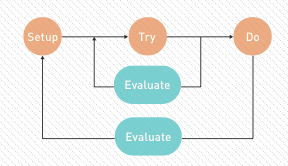
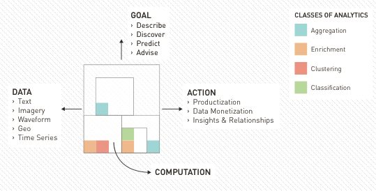

##FRACTAL ANALYTIC MODEL

###Data Science analytics are a lot like broccoli. 

Fractals are mathematical sets that display self-similar patterns. As you zoom in on a fractal, the same patterns reappear. Imagine a stalk of broccoli. Rip off a piece of broccoli and the piece looks much like the original stalk. Progressively smaller pieces of broccoli still look like the original stalk.
Data Science analytics are a lot like broccoli – fractal in nature in both time and construction. Early versions of an analytic follow the same development process as later versions. At any given iteration, the analytic itself is a collection of smaller analytics that often decompose into yet smaller analytics.

####ITERATIVE BY NATURE
Good Data Science is fractal in time -- an iterative process. Getting an imperfect solution out the door quickly will gain more interest from stakeholders than a perfect solution that is never completed. The figure, The Data Science Product Lifecycle, summarizes the lifecycle of the Data Science product. 

  
The Data Science Product Lifecycle 


Set up the infrastructure, aggregate and prepare the data, and incorporate domain expert knowledge. Try different analytic techniques and models on subsets of the data. Evaluate the models, refine, evaluate again, and select a model. Do something with your models and results – deploy the models to inform, inspire action, and act. Evaluate the business results to improve the overall product.

####SMALLER PIECES OF BROCCOLI: A DATA SCIENCE PRODUCT

Components inside and outside of the Data Science product will change with each iteration. Let’s take a look under the hood of a Data Science product and examine the components during one such iteration.
In order to achieve a greater analytic goal, you need to first decompose the problem into sub-components to divide and conquer. The figure, The Fractal Analytic Model, shows a decomposition of the Data Science product into four component pieces.
 

 

  
The Fractal Analytic Model

**GOAL** You must first have some idea of your analytic goal and the end state of the analysis. Is it to discover, describe, predict, or advise? It is probably a combination of several of those. Be sure that before you start, you define the business value of the data and how you plan to use the insights to drive decisions, or risk ending up with interesting but non-actionable trivia.  


**DATA** Data dictates the potential insights that analytics can provide. Data Science is about finding patterns in variable data and comparing those patterns. If the data is not representative of the universe of events you wish to analyze, you will want to collect that data through carefully planned variations in events or processes through A/B testing or design of experiments. Datasets are never perfect so don’t wait for perfect data to get started. A good Data Scientist is adept at handling messy data with missing or erroneous values. Just make sure to spend the time upfront to clean the data or risk generating garbage results.  


**COMPUTATION** Computation aligns the data to goals through the process of creating insights. Through divide and conquer, computation decomposes into several smaller analytic capabilities with their own goals, data, computation and resulting actions, just like a smaller piece of broccoli maintains the structure of the original stalk. In this way, computation itself is fractal. Capability building blocks may utilize different types of execution models such as batch computation or streaming, that individually accomplish small tasks. When properly combined together, the small tasks produce complex, actionable results.  


**ACTION** How should engineers change the manufacturing process to generate higher product yield? How should an insurance company choose which policies to offer to whom and at what price? The output of computation should enable actions that align to the goals of the data product. Results that do not support or inspire action are nothing but interesting trivia.
Given the fractal nature of Data Science analytics in time and construction, there are many opportunities to choose fantastic or shoddy analytic building blocks. The Analytic Selection Process offers some guidance.

