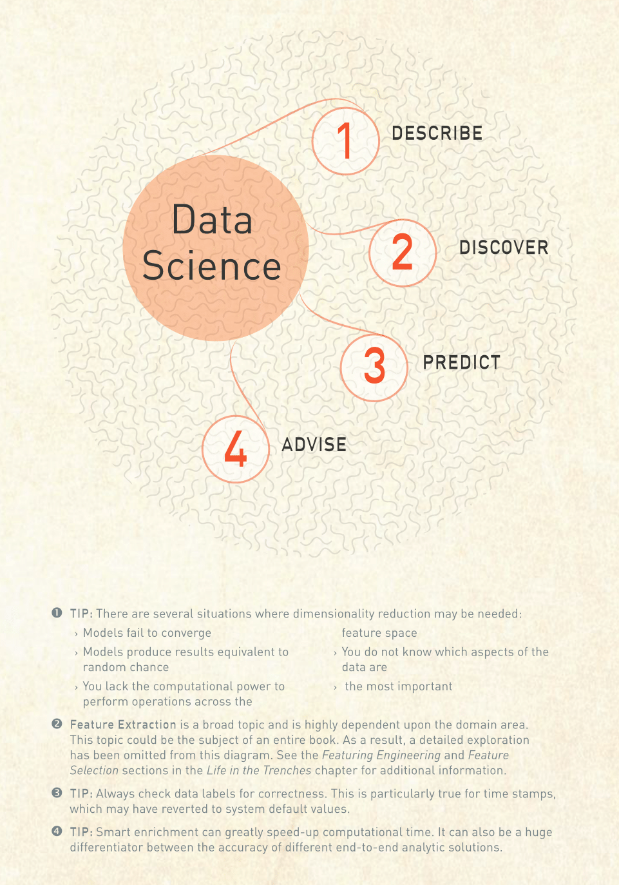
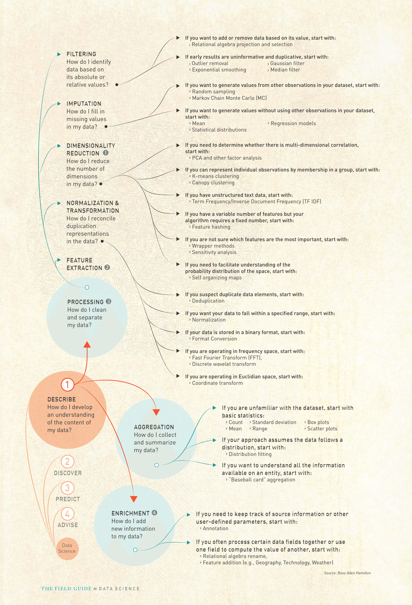
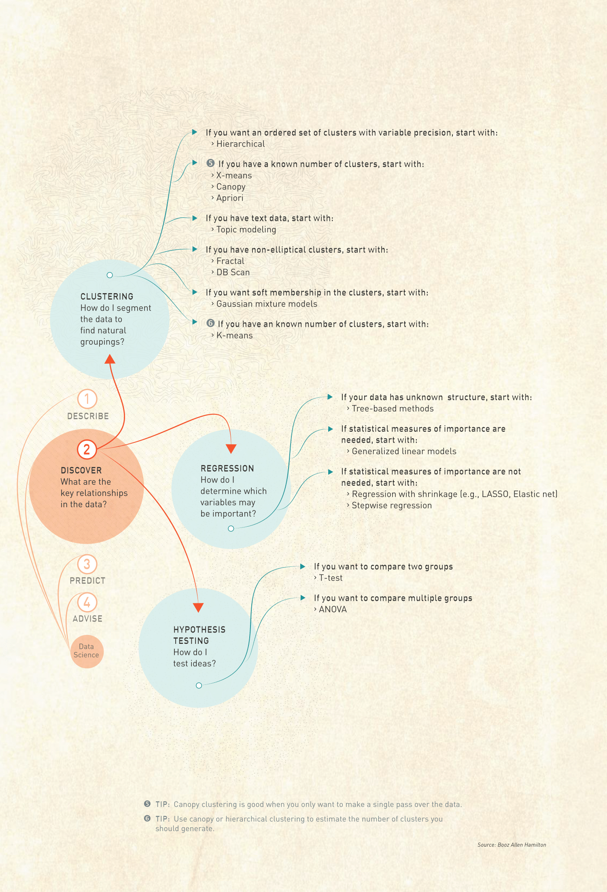
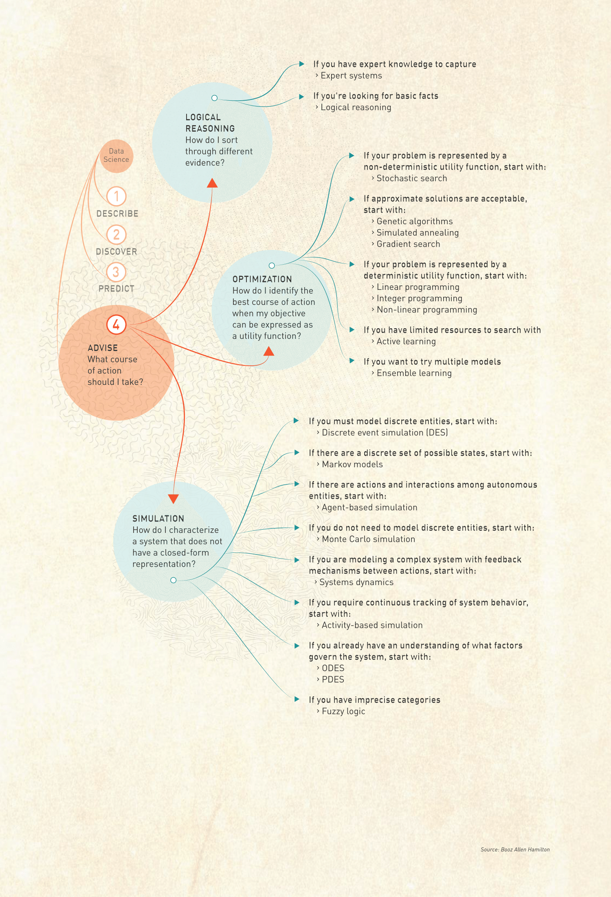

##GUIDE TO ANALYTIC SELECTION

###*Your senses are incapable of perceiving the entire universe, so we drew you a map.*

The universe of analytic techniques is vast and hard to comprehend. We created this diagram to aid you in finding your way from data and goal to analytic action. Begin at the center of the universe (Data Science) and answer questions about your analytic goals and problem characteristics. The answers to your questions will guide you through the diagram to the appropriate class of analytic techniques and provide recommendations for a few techniques to consider.





