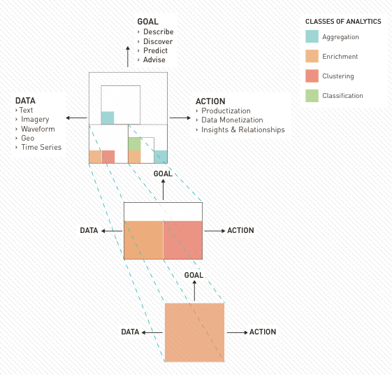
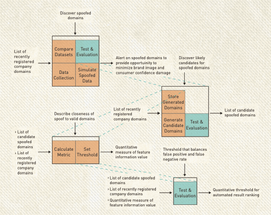
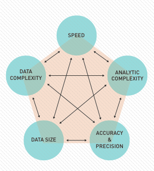

##THE ANALYTIC SELECTION PROCESS

###*If you focus only on the science aspect of Data Science you will never become a data artist.*

A critical step in Data Science is to identify an analytic technique that will produce the desired action. Sometimes it is clear; a characteristic of the problem (e.g., data type) points to the technique you should implement. Other times, however, it can be difficult to know where to begin. The universe of possible analytic techniques is large. Finding your way through this universe is an art that must be practiced. We are going to guide you on the next portion of your journey - becoming a data artist.

###DECOMPOSING THE PROBLEM
Decomposing the problem into manageable pieces is the first step in the analytic selection process. Achieving a desired analytic action often requires combining multiple analytic techniques into a holistic, end-to-end solution. Engineering the complete solution requires that the problem be decomposed into progressively smaller sub-problems. 
The Fractal Analytic Model embodies this approach. At any given stage, the analytic itself is a collection of smaller computations that decompose into yet smaller computations. When the problem is decomposed far enough, only a single analytic technique is needed to achieve the analytic goal. Problem decomposition creates multiple sub-problems, each with their own goals, data, computations, and actions. The concept behind problem decomposition is shown in the figure, Problem Decomposition Using the Fractal Analytic Model.


   

 **Problem Decomposition Using the Fractal Analytic Model**



On the surface, problem decomposition appears to be a mechanical, repeatable process. While this may be true conceptually, it is really the performance of an art as opposed to the solving of an engineering problem. There may be many valid ways to decompose the problem, each leading to a different solution. There may be hidden dependencies or constraints that only emerge after you begin developing a solution. This is where art meets science. Although the art behind problem decomposition cannot be taught, we have distilled some helpful hints to help guide you. When you begin to think about decomposing your problem, look for:  

*  	Compound analytic goals that create natural segmentation. For example, many problems focused on predicting future conditions include both Discover and Predict goals.
*	 Natural orderings of analytic goals. For example, when extracting features you must first identify candidate features and then select the features set with the highest information value. These two activities form distinct analytic goals. 

*	Data types that dictate processing activities. For example, text or imagery both require feature extraction.
*	Requirements for human-in-the-loop feedback. For example, when developing alerting thresholds, you might need to solicit analyst feedback and update the threshold based on their assessment.
*	The need to combine multiple data sources. For example, you may need to correlate two data sets to achieve your broader goal. Often this indicates the presence of a Discover goal. (**TIP:** One of your first steps should be to explore available data sources that have not been previously combined. Emerging relationships between data sources often allow you to pick low hanging fruit.)

###Problem Decomposition Case Study: Identifying Spoofed Domains

Identifying spoofed domains is important for an organization to preserve their brand image and to avoid eroded customer confidence. Spoofed domains occur when a malicious actor creates a website, URL or email address that users believe is associated with a valid organization. When users click the link, visit the website or receive emails, they are subjected to some type of nefarious activity.
Our team was faced with the problem of identifying spoofed domains for a commercial company. On the surface, the problem sounded easy; take a recently registered domain, check to see if it is similar to the company’s domain and alert when the similarity is sufficiently high. Upon decomposing the problem, however, the main computation quickly became complicated.
We needed a computation that determined similarity between two domains. As we decomposed the similarity computation, complexity and speed became a concern. As with many security-related problems, fast alert speeds are vital. Result speed created an implementation constraint that forced us to re-evaluate how we decomposed the problem.
Revisiting the decomposition process led us to a completely new approach. In the end, we derived a list of domains similar to those registered by the company. We then compared that list against a list of recently registered domains. The figure, Spoofed Domain Problem Decomposition, illustrates our approach. Upon testing and initial deployment, our analytic discovered a spoofed domain within 48 hours. 
  

    

  
**Spoofed Domain Problem Decomposition**



In addition to problem decomposition providing a tractable approach to analytic selection, it has the added benefit of simplifying a highly complex problem. Rather than being faced with understanding the entire end-to-end solution, the computations are discrete segments that can be explored. Note, however, that while this technique helps the Data Scientist approach the problem, it is the complete end-to-end solution that must be evaluated. 

###IMPLEMENTATION CONSTRAINTS
In the spoofed domains case study, the emergence of an implementation constraint caused the team to revisit its approach. This demonstrates that analytic selection does not simply mean choosing an analytic technique to achieve a desired outcome. It also means ensuring that the solution is feasible to implement. 
The Data Scientist may encounter a wide variety of implementation constraints. They can be conceptualized, however, in the context of five dimensions that compete for your attention: Analytic Complexity, Speed, Accuracy & Precision, Data Size, and Data Complexity. Balancing these dimensions is a zero sum game - an analytic solution cannot simultaneously exhibit all five dimensions, but instead must make trades between them. The figure, Balancing the Five Analytic Dimensions, illustrates this relationship. 



  
**Balancing the Five Analytic Dimensions**


    As we compiled this section, we talked extensively about ways to group and classify implementation constraints. After much discussion we settled on these five dimensions. We present this model in hopes that others weigh in and offer their perspectives.

Implementation constraints occur when an aspect of the problem dictates the value for one or more of these dimensions. As soon as one dimension is fixed, the Data Scientist is forced to make trades among the others. For example, if the analytic problem requires actions to be produced in near real-time, the Speed dimension is fixed and trades must be made among the other four dimensions. Understanding which trades will achieve the right balance among the five dimensions is an art that must be learned over time.
Some common examples of implementation constraints include:  


*	Computation frequency. The solution may need to run on a regular basis (e.g., hourly), requiring that computations be completed within a specified window of time. The best analytic is useless if it cannot solve the problem within the required time. (TIP: When possible, consider approaches that make use of previously computed results. Your algorithm will run much faster if you can avoid re-computing values across the full time horizon of data.)

*	Solution timeliness. Some applications require near real-time results, pointing toward streaming approaches. While some algorithms can be implemented within streaming frameworks, many others cannot. 

*	Implementation speed. A project may require that you rapidly develop and implement a solution to quickly produce analytic insights. In these cases, you may need to focus on less complex techniques that can be quickly implemented and verified. (**TIP:** Our Data Science Product Lifecycle has evolved to produce results quickly and then incrementally improve the solution.)

*	Computational resource limitations. Although you may be able to store and analyze your data, data size may be sufficiently large that algorithms requiring multiple computations across the full data set are too resource intensive. This may point toward needing approaches that only require a single pass on the data (e.g., canopy cluster as opposed to k-means clustering). 

*	Data storage limitations. There are times when big data becomes so big it cannot be stored or only a short time horizon can be stored. Analytic approaches that require long time horizons may not be possible. (**TIP:** Streaming approaches may be useful for overcoming storage limitations.)

Organizational policies and regulatory requirements are a major source of implicit constraints that merit a brief discussion. Policies are often established around specific classes of data such as Personally Identifiable Information (PII) or Personal Health Information (PHI). While the technologies available today can safely house information with a variety of security controls in a single system, these policies force special data handling considerations including limited retention periods and data access. Data restrictions impact the data size and complexity dimensions outlined earlier, creating yet another layer of constraints that must be considered. 

